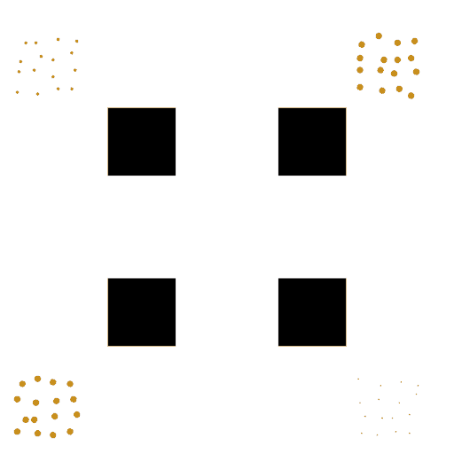

# LibRVO

This library implements our differentiable, stable algorithm for multi-agent navigation. The library supports the following features:
- Optimization-based RVO algorithm that avoids jittering of agents
- Acceleration spatial hash structure for neighbor search
- Agents with variable radius
- Differentiable interface for model-based machine learning
- Multi-threaded batched RVO for machine learning
- Python interface

The library uses CMake as its build tool. The basic RVO library can be run without external dependence. However, the following additional features require external libraries:
- Cholmod for faster linear system solve (download and install this library from: https://people.engr.tamu.edu/davis/suitesparse.html)
- TinyVisualizer for OpenGL visualization (download and install this small library from: https://github.com/gaoxifeng/TinyVisualizer.git)
- Boost/MPFR/GMP for multi-precision support (these are currently used for debugging and we suggest against actually using them during runtime)

We provide the following example programs that are self-explanatory:
|Example          |Explanation                                                  |
|----------------------|--------------------------------------------------------|
|mainSimulator.cpp     |C++ example of single environment                       |
|mainMultiSimulator.cpp|C++ example of batched multiple environments            |
|testRVO.py            |Python3 example of single environment                   |
|testMultiRVO.py       |Python3 example of batched multiple environments        |

